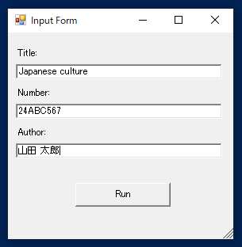
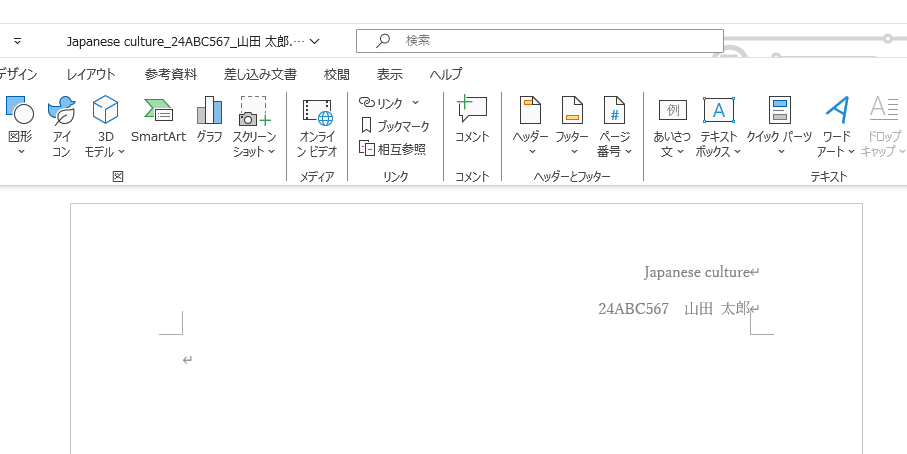
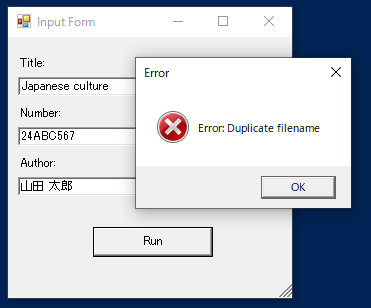
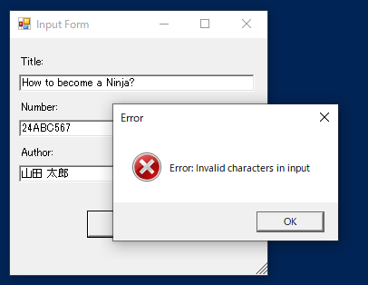
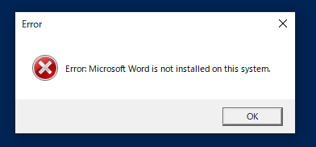

# make-report-template  

Tool to make creating report assignments in Microsoft Word a little easier． 

## usage

1. When the script is executed, a dialog box will appear asking for the title, number, and author. 
2. Enter the values and click the "run" button. 
3. A "title_number_auther.docx" will be created with appropriate headers and footers. 

## Notes
- If a file with the same name exists, an error message will be displayed. Please rename the file. 

- If an inappropriate character is entered for the file name, an error message will be displayed. 

- If Microsoft Word is not installed, an error message will be displayed. 
